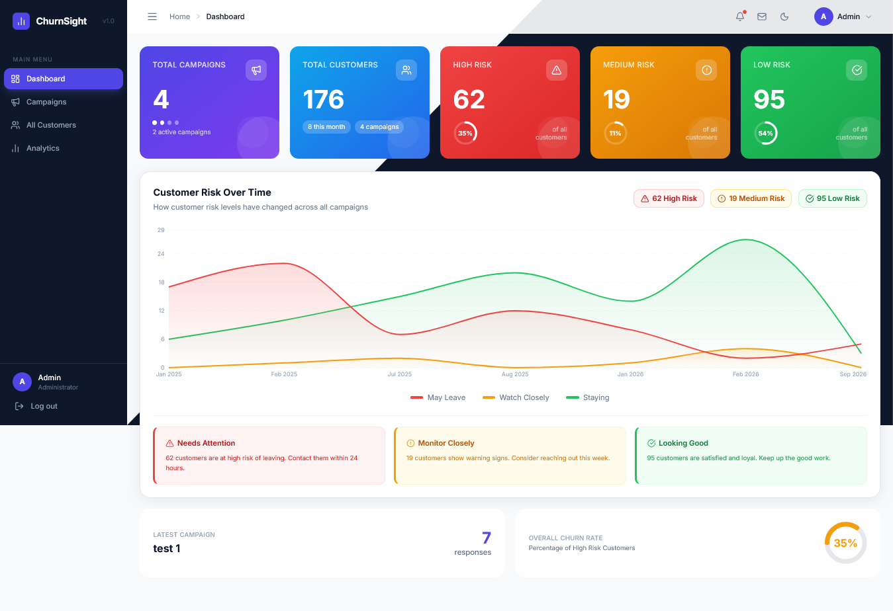
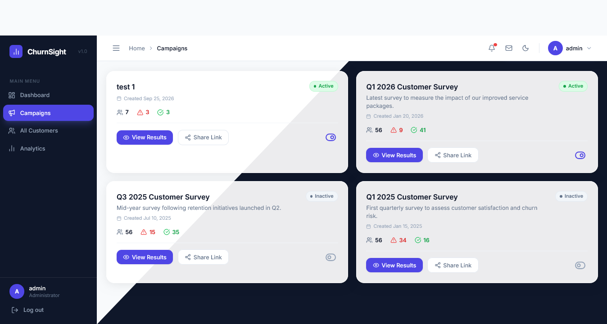
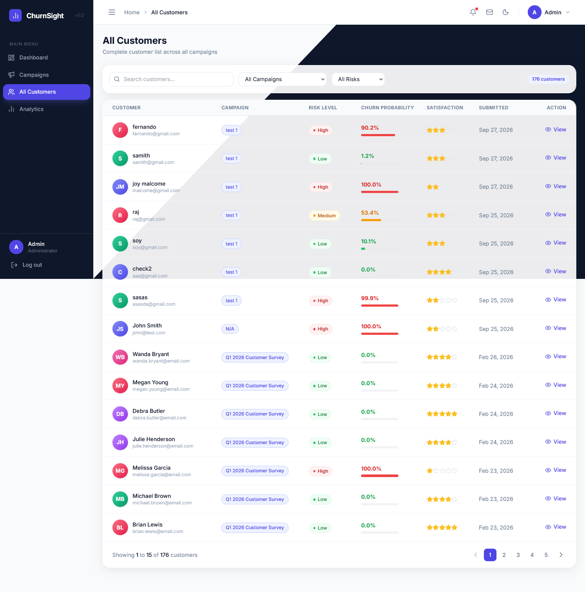
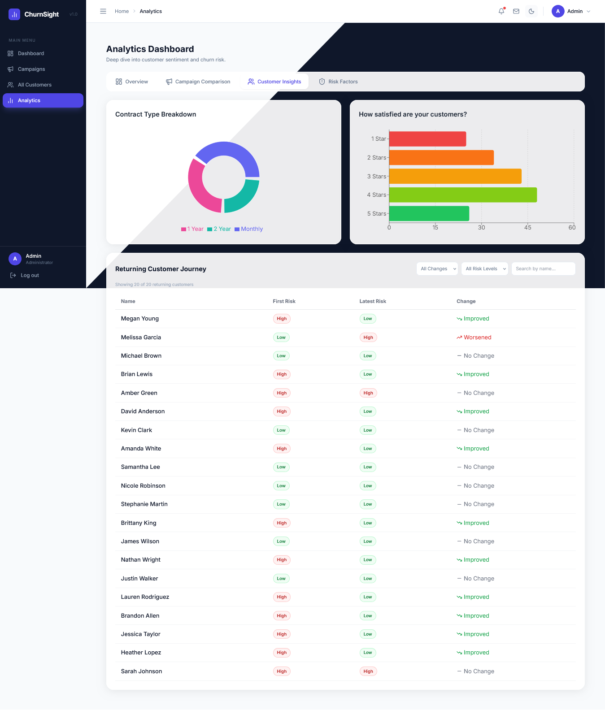

# ChurnSight - Customer Churn Prediction Platform

An explainable AI web application that predicts customer churn 
and provides SHAP-based explanations to help businesses understand 
why customers are at risk of leaving.



---

## What is ChurnSight?

ChurnSight is a full-stack machine learning platform built for 
telecom businesses to identify customers who are likely to cancel 
their subscription. Unlike basic prediction tools, ChurnSight 
explains **why** each customer is at risk using SHAP explainability, 
giving the business actionable insights rather than just a prediction.

---

## Key Features

- **Campaign Management** - Create survey campaigns and share 
  unique links with customers
- **Customer Survey** - 4-step customer-facing survey form 
  collecting service and satisfaction data
- **Churn Prediction** - XGBoost model predicting churn probability 
  with 95.8% accuracy
- **SHAP Explainability** - Individual customer explanations showing 
  exactly which factors drive their risk
- **Admin Dashboard** - Real-time overview of customer risk levels 
  with trend charts
- **Analytics** - Campaign comparison, customer journey tracking, 
  and risk factor analysis
- **Role-based Access** - Separate customer survey and admin portal

---

## Model Performance

| Model | Accuracy | F1 Score | AUC-ROC |
|---|---|---|---|
| Logistic Regression | 95.10% | 91.12% | 99.19% |
| Random Forest | 95.81% | 91.75% | 98.64% |
| **XGBoost (Selected)** | **95.81%** | **92.04%** | **99.06%** |

- Dataset: IBM Telco Customer Churn (7,043 rows, 44 features)
- Class imbalance handled with class weighting (2.8x penalty)
- Top SHAP feature: Satisfaction Score (mean SHAP value 5.07)

---

## Tech Stack

| Layer | Technology |
|---|---|
| Machine Learning | Python, XGBoost, scikit-learn, SHAP |
| Backend | Flask, PostgreSQL 18 |
| Frontend | React, Tailwind CSS, Recharts |
| Authentication | bcrypt, Flask Sessions |
| Development | VS Code, pgAdmin 4 |

---

## Project Structure

```
ChurnSight/
│
├── backend/
│   └── app.py                         # Flask REST API
│
├── frontend/
│   └── src/
│       ├── pages/                     # React pages
│       │   ├── AdminDashboard.jsx
│       │   ├── AdminLogin.jsx
│       │   ├── AllCustomersPage.jsx
│       │   ├── AnalyticsPage.jsx
│       │   ├── CampaignDetail.jsx
│       │   ├── CampaignsPage.jsx
│       │   ├── CustomerDetail.jsx
│       │   ├── Survey.jsx
│       │   └── ThankYou.jsx
│       └── components/                # Reusable components
│           ├── AdminBackground.jsx
│           ├── AdminLayout.jsx
│           ├── RiskBadge.jsx
│           ├── ShapChart.jsx
│           └── ProtectedRoute.jsx
│
├── churnsight_artifacts/
│   ├── xgb_model.pkl                  # Trained XGBoost model
│   ├── scaler.pkl                     # Feature scaler
│   └── feature_cols.pkl               # Feature column list
│
├── churnsight_eda.ipynb               # Exploratory Data Analysis
├── churnsight_preprocessing.ipynb     # Data Preprocessing
├── churnsight_model.ipynb             # Model Training and Evaluation
├── churnsight_shap.ipynb              # SHAP Explainability Analysis
├── database_setup.sql                 # PostgreSQL database schema
├── telco.csv                          # IBM Telco dataset
└── README.md
```

## Screenshots

### Dashboard


### Campaign Management


### Customer Detail with SHAP


### Analytics


---

## Setup Instructions

### Prerequisites
- Python 3.12+
- Node.js 18+
- PostgreSQL 18

### Backend Setup

```bash
# Install Python dependencies
pip install flask flask-cors psycopg2-binary bcrypt 
pip install scikit-learn xgboost shap joblib pandas numpy

# Step 1: Create the database in pgAdmin
# Right click Databases > Create > Database > name it "churnsight"

# Step 2: Open Query Tool in pgAdmin and run:
psql -U postgres -d churnsight -f database_setup.sql

# Or open database_setup.sql in pgAdmin Query Tool and press F5

# Start Flask server
cd backend
python app.py
```

### Frontend Setup

```bash
cd frontend
npm install
npm start
```

### Environment
Update the database password in `backend/app.py`:
```python
def get_db():
    return psycopg2.connect(
        host='localhost',
        port=5432,
        database='churnsight',
        user='postgres',
        password='your_password'
    )
```

---

## Author

**Rishitha**
Final Year BSc Data Science Student
Cardiff Metropolitan University (ICBT Campus, Sri Lanka)

---
